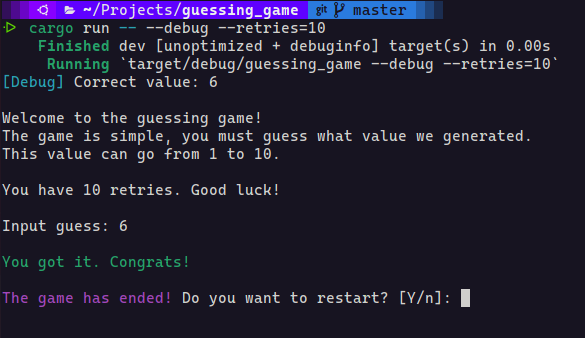

## The guessing game

This is a simple guessing game made with [Rust](https://www.rust-lang.org/).



### Usage:

```sh
cargo run
```

Available arguments:

- debug:
  Will print the generated value. Usage: `--debug`

- retries:
  Defines the number of retries for the game. Usage: `--retries=10`

#### Running with arguments:

```sh
cargo run -- --debug --retries=10
```

### Useful commands:

- Open cargo documentation:

```sh
cargo doc --open
```

- Build binary:

```sh
cargo build
```
